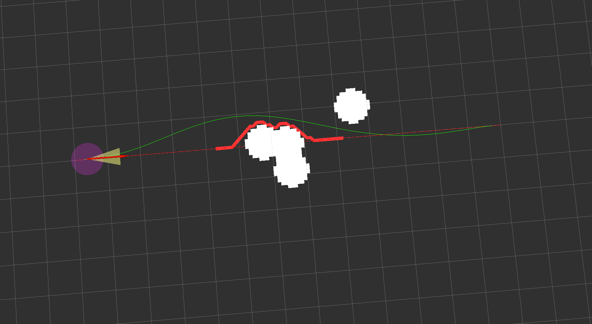

# Two-Circle-EGO-Planner-ROS2

[](https://docs.ros.org/en/humble/)
[](LICENSE)
[](CMakeLists.txt)

面向地面移动机器人的二维局部轨迹规划工程。基于 **Ego-Planner-2D-ROS2**，参考 **SCAN-Planner-Pure-ROS2** 的地图查询方式，引入沿车体航向分布的前后双圆碰撞模型，并在 B 样条优化中加入曲率软约束。

核心优化变量为二维控制点的 `x、y`；ROS 2 节点提供 RViz 交互输入与规划结果可视化。ROS 包名仍为 `ego_planner`，可执行文件为 `motion_plan`。

## 仿真效果



[▶ 查看仿真视频（MP4）](pic/results.mp4)

视频文件位于 `pic/results.mp4`，若仓库页面无法直接播放，可下载后用本地播放器打开。

## 核心功能

- **二维地图**：原始占据层与圆形膨胀层，局部地图随当前车体位置重建。
- **双圆车体模型**：前后圆共用半径，前偏移和后偏移独立设置，碰撞查询考虑航向。
- **二维 A\***：在膨胀地图上生成几何引导路径，供反弹优化构造避障约束。
- **B 样条优化**：包含平滑、避障、速度/加速度可行性代价，以及精修阶段的参考路径拟合代价。
- **曲率软约束**：在实际三次 B 样条上采样计算曲率，代价与解析梯度接入反弹、精修两个阶段。
- **离散路径航向估计**：由相邻离散点的 `atan2(dy, dx)` 计算 `PathPoint.theta`，单位为弧度，末点沿用最后一段方向。
- **RViz 可视化**：显示参考路径、A* 引导路径、局部轨迹、原始障碍物及膨胀障碍物。

当前仓库提供规划与可视化节点、Launch 一键启动文件及预置 `rviz.rviz` 配置，不包含小车动力学仿真或轨迹跟踪控制器。

## 编译与运行

### 环境与依赖

已在 ROS 2 Humble 环境完成编译验证。其他 ROS 2 发行版尚未验证。

需要 CMake 3.22 或更新版本、支持 C++17 的编译器、Eigen3、Boost，以及以下 ROS 2 依赖：

`ament_cmake`、`rclcpp`、`nav_msgs`、`geometry_msgs`、`std_msgs`、`sensor_msgs`、`visualization_msgs`、`tf2`、`tf2_ros`。

一键启动还需要 `launch`、`launch_ros` 和 `rviz2`。

### 编译

在包含本包的工作空间或本项目根目录执行：

```bash
source /opt/ros/humble/setup.bash
colcon build --packages-select ego_planner
source install/setup.bash
```

### 一键启动（推荐）

在完成编译的目录中执行：

```bash
source /opt/ros/humble/setup.bash
source install/setup.bash
ros2 launch ego_planner demo.launch.py
```

该命令同时启动 `motion_plan` 规划节点和 RViz，并自动加载随包安装的 `rviz.rviz`。配置已设置 **Fixed Frame = map** 和规划显示项，无需手动添加；按 `Ctrl+C` 结束本次启动的两个进程。

新增或修改 Launch 文件、`rviz.rviz` 后，请重新执行上述编译命令并加载环境。加载安装环境后，启动命令不依赖当前目录。运行 RViz 需要可用的图形显示环境；在 Docker 内启动时需配置显示转发。

也可指定自己的 RViz 配置：

```bash
ros2 launch ego_planner demo.launch.py rviz_config:=/absolute/path/to/custom.rviz
```

### 分别启动（可选）

调试时可在两个终端分别启动；每个终端都先加载 ROS 2 和工作空间环境：

```bash
source /opt/ros/humble/setup.bash
source install/setup.bash
```

终端 1：

```bash
ros2 run ego_planner motion_plan
```

终端 2：

```bash
rviz2 -d "$(ros2 pkg prefix --share ego_planner)/rviz.rviz"
```

预置配置中的主要显示项如下：

| RViz 显示类型 | 话题 | 内容 |
| --- | --- | --- |
| Grid | — | 平面网格 |
| Path | `/visual_global_path` | 全局参考路径 |
| MarkerArray | `/trajectories` | A* 引导路径 |
| Path | `/visual_local_trajectory` | 优化后的局部轨迹 |
| PointCloud2 | `/visual_obstacles` | 原始障碍物 |
| PointCloud2 | `/visual_local_obstacles` | 局部地图膨胀结果 |

### RViz 交互流程

工具用途以当前代码为准：本项目将 **2D Goal Pose 用于添加障碍物**。

1. 使用 **Publish Point**（`/clicked_point`）依次添加参考路径点，至少添加两个不同位置的点。
2. 使用 **2D Goal Pose**（`/goal_pose`）添加障碍物；可添加多个，也可以先测试无障碍路径。
3. 使用 **2D Pose Estimate**（`/initialpose`）设置机器人起点与航向。在已有参考路径后，该操作会标记需要规划。
4. 在 RViz 中查看规划结果。修改路径或障碍物后，再发送一次 **2D Pose Estimate** 触发更新。

参考路径点击会追加点，障碍物点击也会追加障碍物。当前未提供清空话题，需要重新开始场景时可重启节点。

`/trigger_plan` 虽然创建了订阅，但回调中的启动/停止逻辑目前全部被注释，因此发送该话题不会控制规划。节点启动日志中的部分工具提示与此不一致，请以上述流程为准。

## 双圆车体碰撞模型

地图借鉴 SCAN 的原始/膨胀占据层和前后双圆柱查询，将空间维度保留为 XY，圆柱退化为圆。地图不建立 Z 栅格，也不计算 ESDF；输入障碍物只使用 XY 坐标。

设车体参考点为 `position`，航向为 `yaw`，两个圆心为：

```text
heading = [cos(yaw), sin(yaw)]
front   = position + front_offset * heading
rear    = position - rear_offset  * heading
```

查询采用与 SCAN 相同的顺序：先检查前圆心在膨胀层中的状态，前圆空闲时再检查后圆。任一圆碰撞即视为车体碰撞。前后偏移可以不同，参考点不要求位于两个圆心的中点。

圆半径直接作为障碍物膨胀半径，不再额外叠加一次车体半径。实现按栅格方形间的最小距离保守膨胀，计入栅格离散误差；地图外、非有限输入以及圆轮廓越出地图边界均按非空闲处理。

### 车体尺寸配置

前后偏移均为非负距离：前偏移沿航向，后偏移沿反航向。两者均为 0 时退化为单圆。

若参考点位于长 `L`、宽 `W` 的矩形几何中心，可用以下双圆覆盖矩形：

```text
front_offset = rear_offset = L / 4
radius = sqrt((L / 4)^2 + (W / 2)^2)
```

实际使用时应根据定位参考点、车体外形和所需余量设置参数。默认值用于演示，并不对应特定车型。

### 优化器中的使用方式

初始碰撞分段、反弹检查、反弹基点搜索均使用带航向的双圆查询。控制点航向由相邻控制点估计，轨迹检查航向由相邻采样点估计；退化时使用当前车体航向。

A* 使用单圆膨胀层提供二维几何引导，没有独立的航向搜索维度。优化器也没有独立的 yaw 优化变量。

反弹和精修沿用 SCAN 的内联碰撞检查：检查轨迹前 **2/3**，按首尾距离和地图分辨率计算采样间隔。该检查不覆盖整条轨迹，也不是连续碰撞检测。

## 曲率软约束

`calKappaCost` 在实际均匀三次 B 样条上计算曲率：

```text
kappa = (x' * y'' - y' * x'') / (x'^2 + y'^2)^(3/2)
penalty = max(0, abs(kappa) - max_curvature)^2
```

每个节点区间取 5 个样本（含两端），将解析梯度分配到对应的 4 个控制点。左右转弯使用同一绝对曲率上限。曲率代价及梯度加入反弹、精修两阶段的目标，权重仅乘一次。

计算采用归一化节点坐标下的空间导数，单纯调整轨迹时间不会降低曲率代价。分母加入正则化，避免重复控制点或接近静止时出现除零。静止点的几何曲率本身无定义，这一处理不保证原地尖点或折返的运动学可行性。

这是**采样软约束**：允许与其他代价权衡，不保证所有采样点或采样点之间严格低于曲率上限。固定首尾控制点、障碍物与曲率限制也可能互相冲突；上限过严或权重过大可能导致求解不收敛。

## ROS 2 参数

下列参数在节点启动时读取，当前没有动态参数更新回调。

| 参数 | 默认值 | 单位/含义 |
| --- | --- | --- |
| `vehicle.circle_radius` | **0.4** | m，两个圆共用的半径 |
| `vehicle.front_circle_offset` | 0.5 | m，参考点到前圆心的距离 |
| `vehicle.rear_circle_offset` | 0.5 | m，参考点到后圆心的距离 |
| `optimization.max_curvature` | 2.0 | m⁻¹，绝对曲率上限，可按最小转弯半径 `R` 设置为 `1/R` |
| `optimization.curvature_weight` | 0.1 | 曲率惩罚权重，0 表示关闭 |

配置示例：

```bash
ros2 run ego_planner motion_plan --ros-args \
  -p vehicle.circle_radius:=0.5 \
  -p vehicle.front_circle_offset:=0.4 \
  -p vehicle.rear_circle_offset:=0.3 \
  -p optimization.max_curvature:=1.0 \
  -p optimization.curvature_weight:=1.0
```

优化日志中的 `curvature` 为加权后的曲率代价。值为 0 可能表示当前样本未超限，也可能是权重被设为 0。

地图 XY 尺寸、分辨率和其他运动参数仍在源码中配置，尚未全部暴露为 ROS 参数。当前节点的地图默认尺寸为 `50 × 50 m`，分辨率为 `0.1 m`。节点层运动参数与优化器内部限制分别设置，修改时需核对两处。

## 话题接口

节点名为 `ego_planner_interactive_node`。下表使用默认命名空间下的话题名。

| 方向 | 话题 | 消息类型 | 用途 |
| --- | --- | --- | --- |
| 订阅 | `/clicked_point` | `geometry_msgs/msg/PointStamped` | 追加参考路径点 |
| 订阅 | `/goal_pose` | `geometry_msgs/msg/PoseStamped` | 追加障碍物，使用位置 XY |
| 订阅 | `/initialpose` | `geometry_msgs/msg/PoseWithCovarianceStamped` | 更新车体起点、航向并触发重规划 |
| 订阅 | `/trigger_plan` | `std_msgs/msg/Bool` | 当前回调无有效逻辑 |
| 发布 | `/visual_global_path` | `nav_msgs/msg/Path` | 参考路径 |
| 发布 | `/trajectories` | `visualization_msgs/msg/MarkerArray` | A* 引导路径 |
| 发布 | `/visual_local_trajectory` | `nav_msgs/msg/Path` | 规划轨迹 |
| 发布 | `/visual_obstacles` | `sensor_msgs/msg/PointCloud2` | 原始障碍物 |
| 发布 | `/visual_local_obstacles` | `sensor_msgs/msg/PointCloud2` | 膨胀障碍物 |

`/rviz_input_global_path` 和 `/rviz_input_obstacles` 的订阅创建代码目前被注释，不能直接作为已启用的数据入口。

## 目录结构

```text
.
├── CMakeLists.txt
├── package.xml
├── launch/demo.launch.py                 # 一键启动规划节点与 RViz
├── rviz.rviz                             # RViz 预置配置
├── pic/
│   ├── result.png                        # 仿真图片
│   └── results.mp4                       # 仿真视频
├── include/trajectory_obstacles_publisher.h
├── src/trajectory_publisher.cpp           # ROS2 交互、参数、发布及路径离散
└── planner/
    ├── GridMap2D/                         # 二维地图与双圆查询
    ├── path_searching/                    # 二维 A* 几何引导
    ├── bspline_opt/                       # B 样条、L-BFGS 与各项代价
    └── plan_manage/                       # 规划流程与接口
```


## 参考与致谢

- [ZJU-FAST-Lab/ego-planner](https://github.com/ZJU-FAST-Lab/ego-planner)：原始 EGO-Planner 算法。
- [JackJu-HIT/Ego-Planner-2D-ROS2](https://github.com/JackJu-HIT/Ego-Planner-2D-ROS2)：本项目的二维 ROS 2 基础工程，也是当前 Git remote 指向的仓库。
-  [JackJu-HIT/SCAN-Planner-Pure-ROS2](https://github.com/JackJu-HIT/SCAN-Planner-Pure-ROS2)：局部占据地图与沿航向前后偏移查询的参考实现。

本文标题使用 `Two-Circle-EGO-Planner-ROS2` 标识双圆版本；ROS 包名和远程仓库地址未随标题修改。用于二次开发或论文时，请注明所使用的仓库地址与版本，并保留上游署名。

## 作者与交流

作者：**Chunyu Ju / JackJu**。

- 微信公众号：**机器人规划与控制研究所**。[相关技术文章](https://mp.weixin.qq.com/s/tjHMyyEMzsonYaVbrq4WTQ)
- Bilibili：**机器人算法研究所**。[原项目演示视频](https://www.bilibili.com/video/BV11RUfB8ELb/)

以上链接沿用基础项目资料，不代表本双圆版本的验证记录。

## 许可证

项目采用 [MIT License](LICENSE)，使用、修改与分发请遵循许可证并保留版权声明。

*文档更新：2026-09-20*
